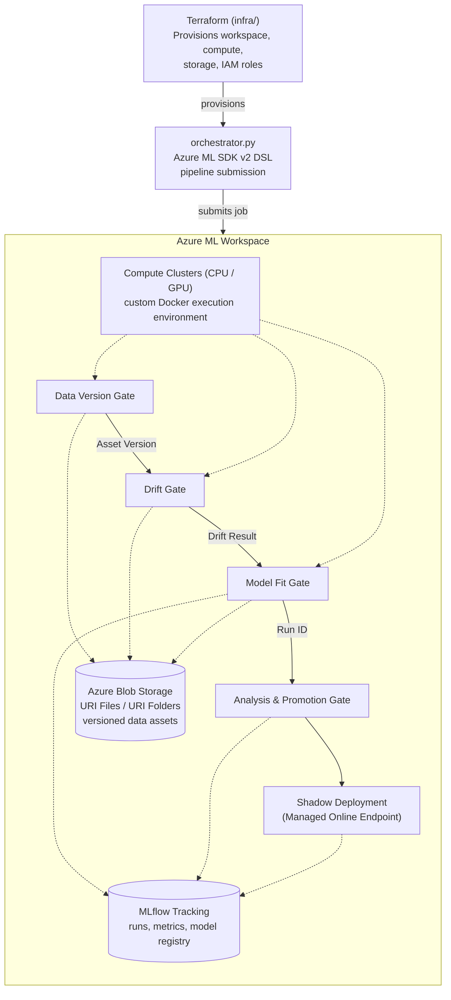

# Azure Gates

A production-like, gate based MLOps pipeline built on Azure ML SDK v2.

**Please Note** This project is still being developed, and as such, I am updating the documentation as I complete pre-defined phases for development.

## Table of Contents

- [Architecture Overview](#architecture-overview)
- [Tech Stack](#tech-stack)
- [Prerequisites](#prerequisites)
- [Repository Structure](#repository-structure)
- [Pipeline Gates](#pipeline-gates)
- [Quickstart](#quickstart)
- [Data Asset Governance](#data-asset-governance)
- [Future Improvements](#future-improvements)
- [Troubleshooting / Common Issues](#troubleshooting--common-issues)

## Architecture Overview



**Key Azure services in play:**

| Service | Role in this project |
|---|---|
| **Azure ML Workspace** | Central hub coordinating compute, storage, jobs, and tracking |
| **Azure Blob Storage** | Backs the `URI File` / `URI Folder` data assets passed between gates |
| **Azure ML Compute (CPU/GPU clusters)** | Executes each gate as a job, using a custom Docker-based environment |
| **MLflow (Azure ML-native)** | Tracks experiment runs, metrics, and the model registry |
| **Azure ML Managed Online Endpoints** | Hosts the shadow deployment for the promoted model |
| **Terraform** | Provisions the workspace, compute targets, storage, and IAM roles |

## Tech Stack

| Layer | Tool |
|---|---|
| ML platform | Azure ML (SDK v2, DSL pipelines) |
| Infra as code | Terraform |
| Package/environment management | `uv` |
| Task runner | `just` |
| Experiment tracking / model registry | MLflow (Azure ML-native) |
| Execution environment | Custom Docker image on Azure ML Compute (CPU/GPU) |
| Data storage | Azure Blob Storage (via Azure ML `URI File` / `URI Folder` data assets) |
| Model serving | Azure ML Managed Online Endpoints (shadow deployment) |
| CI/CD | GitHub Actions (`.github/workflows`) |

## Prerequisites

Before running through the quickstart, you'll need:

- An Azure subscription with permission to create resource groups, storage accounts, and Azure ML workspaces
- [Terraform](https://developer.hashicorp.com/terraform/install) installed locally
- The [Azure CLI](https://learn.microsoft.com/en-us/cli/azure/install-azure-cli) (`az`), authenticated (`az login`) with access to the target subscription
- Python (version pinned in `.python-version`) and [`uv`](https://docs.astral.sh/uv/getting-started/installation/) installed
- `just` installed if you want to use the provided task runner ([installation guide](https://github.com/casey/just#installation))
- If you plan to use GPU compute: GPU quota approved at the **workspace** level (see Troubleshooting below — this is not the same as subscription-level quota)
- IAM roles `Storage Blob Data Contributor` and `AzureML Data Scientist` assigned to your compute target (Terraform handles this once quota is available)
- Azure App Registration to allow job submission via Github Actions. This is **required** to submit the jobs as the `az` cli tool requires this for authentication before submission (see Quickstart for how to create the required app registration to access your credentials)

## Repository Structure

```
AzureGates/
├── .github/workflows/     # CI/CD pipeline definitions (GitHub Actions)
├── dataset/               # Raw/sample data used as the pipeline's source data asset
├── infra/                 # Terraform configs for provisioning Azure ML resources,
│                           #   plus the environment build script (create_environment.py)
├── settings/               # orchestrator_config.yaml — pipeline submission config
│                           #   (subscription, resource group, workspace, environment name/version)
├── src/                    # Gate implementations — one module per pipeline stage
│                           #   (data versioning, drift detection, model fit, promotion, deployment)
├── orchestrator.py         # Defines and submits the Azure ML DSL pipeline (wires gates together
│                           #   via Input/Output, matching the flow in the architecture diagram)
├── justfile                # Task runner shortcuts (e.g. `just run`)
├── pyproject.toml / uv.lock # Python dependency management via uv
├── .env.example             # Template for required environment variables
└── .amlignore                # Excludes files from being uploaded with each Azure ML job
```

## Pipeline Gates

### 1. Data Version Gate
Registers a versioned data asset (`URI File`/`URI Folder`) in the Azure ML workspace from the raw source data — typically after a train/test split. This gives every downstream run a traceable, immutable snapshot of the data it trained against, rather than pointing at a mutable blob path. Outputs an asset version consumed by the Drift Gate.

### 2. Drift Gate
Compares the newly versioned dataset against a reference (e.g. the previous production dataset or a fixed baseline) to check for statistical drift in feature distributions before allowing training to proceed. This is the gate that prevents silently retraining on data that has shifted in ways that would invalidate the model.

### 3. Model Fit Gate
Trains the model and evaluates it against defined performance criteria before it's allowed to proceed to promotion. Logs the run (params, metrics, artifacts) to MLflow and emits a Run ID used by downstream gates to retrieve the trained model.

### 4. Analysis & Promotion Gate
Reviews the Model Fit Gate's output run and decides whether the new model should be promoted — typically by comparing it against the currently deployed model's metrics in the MLflow registry, and if it passes, registering it as a new model version / stage.

### 5. Shadow Deployment
Deploys the promoted model to an Azure ML Managed Online Endpoint in shadow mode — receiving production traffic (or a mirrored copy of it) without serving live responses, so its behavior can be validated against the incumbent model before a full cutover.

## Quickstart

### 1. Provision Azure ML Resources

Provision the needed Azure ML resources via terraform

```
terraform plan
terraform apply -auto-approve
```

Ensure to create a `terraform.tfvars` file to list the secrets for the project

### 2. Configure Workspace

Create / Rename fields in the `settings/orchestrator_config.yaml` file for your project. This is used only for Azure ML DSL pipeline submission.
Any of this information is injected directly into the Azure ML job runtime and can be fetched via
environment variables

```
mv .env.example .env
# Fill in your subscription id, resource group, and workspace name
```

### 3. Create Azure ML Execution Environment

To configure the local development environ, in a new `uv` project, run

```
uv sync --frozen
```

This will install the required versions of all packages locally.

We need an execution environment on Azure ML to execute our jobs. Azure ML has numerous pre-defined images with packages already installed, but
in my case, I needed some extras added. Our build environment is created based on a defined Docker image, as it allows use to install and us `uv` to build the environment image,
speeding up the install process

```
uv run infra/environment/create_environment.py
```

This can take quite some time to run, so allow ample time to complete. Once this is done, add the environment name and version to your `settings/orchestrator_config.yaml` file. Make sure the name matches exactly. The name
and version can be found under the `Environment` tab in your Azure ML workspace.

### 4. Submit an Azure ML DSL Pipeline Job

I've included a just file to make running the commands easier than having to set and source the environment
variables every time.

```
just run
```

Alternatively, if you want to set the environment variables yourself before the run, you can do the following

```
set -a
source .env
set +a
uv run orchestrator.py
```

This configures an Azure ML DSL pipeline build to execute the gates. It makes use of the azure SDK v2 to configure this. Alternatively, you can create the yaml configuration for this and submit jobs using that instead

### 5. Github Actions Requirements
In order to submit jobs via Github Actions, we need to create an `AZURE_CLIENT_ID` and `AZURE_TENANT_ID` via Azure App Registrations. This is required to authenticate the `az` cli within the CI/CD workflow. To create these credentials, do the following:
```bash
# 1. Create the app registration
az ad app create --display-name "github-actions-mlops"
# "appId" in the output is the AZURE_CLIENT_ID

# 2. Create a service principal for the app (required for role assignment)
az ad sp create --id <appId-from-above>

# 3. Get your tenant and subscription IDs
az account show --query "{subscriptionId:id, tenantId:tenantId}" -o table

# 4. Assign Contributor role on the resource group
az role assignment create \
  --assignee <appId> \
  --role "Contributor" \
  --scope /subscriptions/<subscription-id>/resourceGroups/<resource-group-name>
# your subscription and resource group in your .env file

# 5. Add the federated credential
az ad app federated-credential create \
  --id <appId-from-above> \
  --parameters '{
    "name": "github-actions-production",
    "issuer": "https://token.actions.githubusercontent.com",
    "subject": "repo:<your-github-repo-url>:environment:production",
    "audiences": ["api://AzureADTokenExchange"]
  }'
````

Once this is done, register your `AZURE_CLIENT_ID`, `AZURE_TENANT_ID`, `AZURE_SUBSCRIPTION_ID`, `AZURE_RESOURCE_GROUP` and `AZURE_WORSPACE_NAME` as secrets in Github Actions. Then, your CI/CD pipeline should be set up!

## Data Asset Governance

For this project, we make use of a static csv file as our "raw" data. In reality, this data might come from an S3 bucket of Blob Storage, SQL tables, etc.
This raw data is stored in a `URI File` data asset. This is something that lives in your blob storage
associated with your Azure ML project workspace. With Azure and it's DSL pipelines, we can pass these
data assets to jobs as an `Input`. In this case, Azure automatically injects the asset into the job
runtime, and we can fetch the path to access these jobs (see `orchestrator.py` for how to pass `Input`'s,
and any of the gates for how to access the data).

For best practices and ensuring clear data versions between runs, we can register a data asset containing
our data after performing a train-test split. In a DSL pipeline, we define an `Output` that allows us
to create and register data assets from job runs simply by specifying the `name` field (again, see `orchestrator.py` for an example of how to use `Output`'s, and any gate script on how to send an `Output`). With DSL pipelines, we are able to directly any `Output` from a previous gate as an `Input` to another gate. This
is quite powerful and allows us to pass and share information between pipeline jobs easily and cleanly.

For this project, we mainly use `URI Files` and `URI Folders` for data assets, but other asset types exist
like model assets, compute assets, etc. The list of assets and their types can be found [in the official documentation](https://learn.microsoft.com/en-us/azure/machine-learning/concept-azure-machine-learning-v2?view=azureml-api-2&tabs=sdk#data)

## Future Improvements

This project is not going to be perfect. These are some things off the top of my head that I would like to add once I have completed the original vision
and would like to come back to the project.

- [x] <del>Add CI/CD pipeline for retraining</del>
- [x] <del>Add a training config for standard parameters</del>
- [ ] **ADD TESTS** for clean code practices
- [ ] Additional gate checks for things like schema validation, null validation, etc
- [x] <del>Automated model card artifact in Markdown format</del>
- [ ] Azure model monitoring to replace manual drift detection calculations.
- [ ] Feature store integration
- [x] <del>Improve README with more information and better architectural diagram</del>

My inital thoughts of upgrades follows, for now based on my availability, the following: training configs with yaml, automated model cards, endpoint monitoring and drift replacement, tests

Everything else is a nice to have, but to me this takes things a step further to a production like setup

## Model Monitoring Note
Azure ML is great in the sense that it has model monitoring built into the platform. We just need to specify the model and reference data (and some additional information), and we have access to complete model monitoring metrics without needing to perform the calculations by hand. In reality, this should be used to perform the respective drift checks to assess if new model training is needed. This way, there is a physical record of checks and metrics performed, and we can access the associated metrics fro mruns to perform the assessment of drift or not. 

This step would replace the current drift detection calculation checks, and instead lookup / download the latest model metrics, and use the pre-calculated statistics to determine if the model or data has drifted. From there, we would perform additional schema validations to ensure data consistency.

## Personal Note

This project has been what feels like a long time coming, but really it's just been a few months of me working on it when I had the time to. In this time, I've had
some ideas for new projects come up that I would eventually like to explore. Once I have completed the original vision for this project, I plan to pause development
for a little while to explore a new project that interests me. After some time, I plan to come back and gradually improve what exists based on the future improvements.
Ideally, I'd like to have my main projects that I come back to and just toy around with, while working on smaller scale POC's, and I think this fits the bill for
one of those big projects.

I'm quite proud of what I've learned through Azure over this time, and all of the pain and suffering dealing with GPU access issues, IAM permission role issues, I've
learned a hell of a lot about the Azure ecosystem, and improved my understanding of it as well. That is *exactly* what I was hoping to get out of this, and by the end,
I will have a fully functioning AzureML DSL pipeline. While not production
grade in my eyes (as all things can be improve), it's better than other pipelines I've made.

## Troubleshooting / Common Issues

In the early stages of development, so far I have experience some issues that caused me a decent amount of pain.

- **Issues Creating Data Assets**: This caused me a great headache early on. It simply boils down to not having the `Storage Blob Data Contributor` IAM role attached to your compute target. This is easier to apply with terraform, so if you run into the issue, the solution for me was to run `terraform destroy` and re-apply the plan to get what I needed
- **Issues Submitting Jobs**: This is something else that caused me a lot of pain. Like the data asset issue, you need the `AzureML Data Scientist` IAM role attached to your compute target as well. This is what is running the jobs and needs additional access to the workspace. This one took an embarrassing amount of time to figure out.
- **Azure ML Job Submission Taking Too Long**: This can happen when you try to submit an Azure ML job and it tries to upload your entire codebase as part of the job execution. You can simply get around this by creating an `.amlignore` file and only uploading exactly what is needed. Once this was fixed, this has not been an issue since
- **GPU Access in Azure ML**: I initially did another AzureML project several months back, and I was looking to get GPU access for that project as well. I only very recently identified (As embarrassing to say), that I need to request the GPU access from *inside* the AzureML *WORKSPACE*, rather than at the *SUBSCRIPTION* level. The pain of back and forth with support requests, and thinking that GPU's are impossible to get, was simply performed by requesting access inside my workspace. To do the same, first head to **Azure Machine Learning** > **Quota** > . From there, you can configure your workspace quota and request GPU access.
- **Using Terraform to Create Resources**: At first, it is easier to use terraform to ignore compute, and instead spin up other resources, and see what compute is available to you. In my case, for both CPU and GPU clusters, I
needed to request access first from Azure, receive approval, and then spin up the compute targets using terraform. This way, you won't run into issues with access certain computes that are not yet available to you.
Once you have the quota available, adding your compute and required IAM roles to your compute can be taken care of by Terraform itself
- **Azure ML Conflicting MlFlow versions**: This is perhaps one of the bigger pain points that I had experienced. When installing azureml-mlflow, it installs `mlflow-skinny` alongside it. The skinny package is missing some
of the essential pieces, so we need to install the standard `mlflow` package alongside this. There is really no issue when logging experiments to your workspace MlFlow instance, but the greatest issue is when you try and log
a model. If you install the latest MlFlow version, you might run into `api/v2/... not available` or something similar to that. This took some time to figure out, but Azure ML still uses older versions of MlFlow within it's
ecosystem. Since you are using a new version, trying to log a model will and use the *NEW* API, rather than the old one. Additionally, you need both `mlflow` and `mlflow-skinny` to be pinned to the same version, otherwise
the issue will still persist. After much trial and error, I found that forcing both `mlflow` and `mlflow-skinny` to version 2.7.1 made logging models work. I'm not sure if this is a known problem with Azure ML, or perhaps
I have done something incorrectly when configuring my workspace, but this took literal **DAYS** to figure out. Save yourself the time and energy, and make sure you pin both of these versions before logging any of the models

